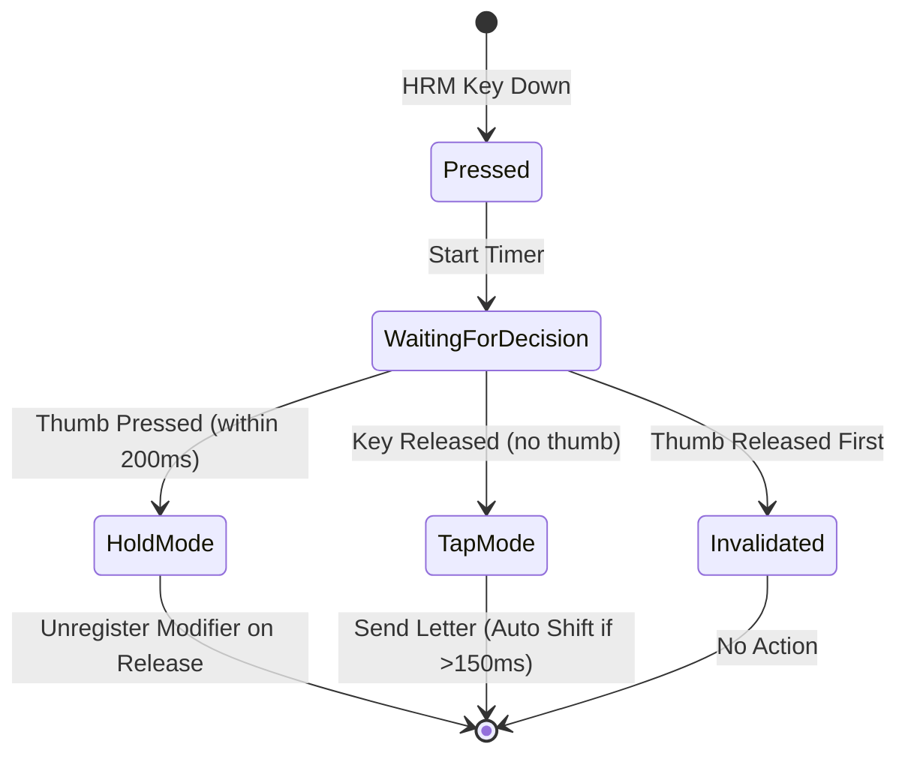

# Conditional Home-Row Mods Implementation

## Summary

Implemented a custom home-row mod system for the Moonlander keyboard where:
- Home-row keys (A, S, D, F, J, K, L, ;) act as **regular letters on layer 0**
- When thumb layer keys are held (left → layer 1, right → layer 2), home-row keys become **dual-function** (letter on tap, modifier on hold)
- Pressing home-row first, then adding thumb within tapping term (200ms) → activates modifier
- Releasing thumb before home-row → no action (invalidated)
- Auto Shift works for home-row keys on base layer (150ms timeout)

## How It Works



## Modified Files

### [config.h](file:///Users/jkopanski/oryx-with-custom-qmk/AWDDG/config.h)
Added tap-hold configuration:
- `TAPPING_TERM 200` - 200ms window for tap/hold decision
- `TAPPING_TERM_PER_KEY` - Per-key customization support
- `CHORDAL_HOLD` - Same-hand chord detection

```diff:config.h
#define PERMISSIVE_HOLD

#define USB_SUSPEND_WAKEUP_DELAY 0
#define AUTO_SHIFT_TIMEOUT 150
#define CAPS_LOCK_STATUS
#define SERIAL_NUMBER "AWDDG/bvZ0wj"
#define LAYER_STATE_8BIT

#define RGB_MATRIX_STARTUP_SPD 60

===
#define PERMISSIVE_HOLD

#define USB_SUSPEND_WAKEUP_DELAY 0
#define AUTO_SHIFT_TIMEOUT 150
#define CAPS_LOCK_STATUS
#define SERIAL_NUMBER "AWDDG/bvZ0wj"
#define LAYER_STATE_8BIT

#define RGB_MATRIX_STARTUP_SPD 60

// Tapping term for tap-hold decisions (ms)
#define TAPPING_TERM 200
#define TAPPING_TERM_PER_KEY

// Enable Chordal Hold for same-hand detection
#define CHORDAL_HOLD
```

---

### [rules.mk](file:///Users/jkopanski/oryx-with-custom-qmk/AWDDG/rules.mk)
Added `DEFERRED_EXEC_ENABLE = yes` for timer-based callbacks.

```diff:rules.mk
CONSOLE_ENABLE = no
COMMAND_ENABLE = no
AUTO_SHIFT_ENABLE = yes
MOUSEKEY_ENABLE = no
ORYX_ENABLE = yes
RGB_MATRIX_CUSTOM_KB = yes
SPACE_CADET_ENABLE = no
===
CONSOLE_ENABLE = no
COMMAND_ENABLE = no
AUTO_SHIFT_ENABLE = yes
MOUSEKEY_ENABLE = no
ORYX_ENABLE = yes
RGB_MATRIX_CUSTOM_KB = yes
SPACE_CADET_ENABLE = no
DEFERRED_EXEC_ENABLE = yes
```

---

### [keymap.c](file:///Users/jkopanski/oryx-with-custom-qmk/AWDDG/keymap.c)
Major additions:

1. **Custom keycodes** (`HRM_A` through `HRM_SCLN`)
2. **State tracking** for each home-row key (pressed, timing, decision status)
3. **Helper functions**:
   - [hrm_handle_press()](file:///Users/jkopanski/oryx-with-custom-qmk/AWDDG/keymap.c#170-194) - Initialize state and start timer
   - [hrm_handle_release()](file:///Users/jkopanski/oryx-with-custom-qmk/AWDDG/keymap.c#195-229) - Decide tap/hold/invalidated
   - [hrm_activate_modifier()](file:///Users/jkopanski/oryx-with-custom-qmk/AWDDG/keymap.c#113-124) - Register modifier key
   - [hrm_activate_tap()](file:///Users/jkopanski/oryx-with-custom-qmk/AWDDG/keymap.c#125-148) - Send letter (with Auto Shift support)
   - [hrm_check_pending_keys_for_hold()](file:///Users/jkopanski/oryx-with-custom-qmk/AWDDG/keymap.c#230-244) - Transition pending keys when thumb pressed
   - [hrm_invalidate_pending_keys()](file:///Users/jkopanski/oryx-with-custom-qmk/AWDDG/keymap.c#245-260) - Cancel pending keys when thumb released
4. **Chordal hold layout** for same-hand detection
5. **Updated [process_record_user()](file:///Users/jkopanski/oryx-with-custom-qmk/AWDDG/keymap.c#461-573)** with HRM and thumb layer handling

## Modifier Mappings (macOS)

| Key | Modifier |
|-----|----------|
| A | Control |
| S | Option |
| D | Command |
| F | Shift |
| J | Shift |
| K | Command |
| L | Option |
| ; | Control |

## Next Steps

1. **Build firmware**: Run the "Fetch and build layout" GitHub Action
2. **Flash with Keymapp**: Download the built firmware and flash to keyboard
3. **Test** the scenarios listed in the implementation plan

## Notes

- The existing `DUAL_FUNC_0-3` keys on layer 2 are preserved unchanged
- IDE lint errors about `bool`, `uint16_t`, etc. are expected - these types are provided by QMK headers during the actual build
